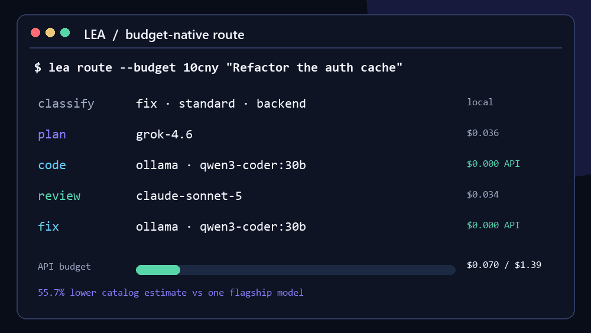
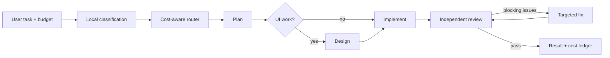

<p align="center">
  
</p>

<p align="center">
  <strong>Spend intelligence where it matters.</strong><br>
  A budget-native coding agent that plans with strong models, implements with fast models,
  and reviews with an independent provider.
</p>

<p align="center">
  <a href="https://github.com/charlesenchine-arch/Light-weight-Ensemble-Agent/actions/workflows/ci.yml"></a>
  <a href="https://www.python.org/downloads/"></a>
  <a href="LICENSE"></a>
  <a href="https://github.com/charlesenchine-arch/Light-weight-Ensemble-Agent/stargazers"></a>
</p>

<p align="center">
  <a href="#quick-start">Quick start</a> ·
  <a href="#how-it-works">How it works</a> ·
  <a href="#why-lea">Why LEA</a> ·
  <a href="docs/README.zh-CN.md">简体中文</a>
</p>

---

LEA (**Light-weight Ensemble Agent**) is a local coding agent that treats your API
budget as a first-class constraint. Instead of sending every token to one flagship
model, LEA routes each stage to the model that offers the best value for that job.

```text
$ lea run --budget 10cny "Fix the flaky auth tests and explain the cause"

  plan    → capable reasoning model
  code    → fast coding model
  review  → a different provider
  spend   → tracked and capped before every request
```

> LEA is early-stage software. Use it on version-controlled projects and review
> changes before shipping them to production.

## Quick start

### One-command install

macOS / Linux:

```bash
curl -LsSf https://raw.githubusercontent.com/charlesenchine-arch/Light-weight-Ensemble-Agent/main/install.sh | sh
```

Windows PowerShell:

```powershell
irm https://raw.githubusercontent.com/charlesenchine-arch/Light-weight-Ensemble-Agent/main/install.ps1 | iex
```

The installer bootstraps the official `uv` tool manager when needed, downloads the
pinned v0.3.0 wheel, verifies its SHA-256 digest, and installs LEA in isolation without
administrator access. [Inspect the scripts and alternatives before running them](docs/install.md).

### Already use pipx?

With [pipx](https://pipx.pypa.io/) installed:

```bash
pipx install git+https://github.com/charlesenchine-arch/Light-weight-Ensemble-Agent.git@v0.3.0
```

Or install for development:

```bash
git clone https://github.com/charlesenchine-arch/Light-weight-Ensemble-Agent.git
cd Light-weight-Ensemble-Agent
python -m venv .venv

# Windows PowerShell
.\.venv\Scripts\Activate.ps1

# macOS / Linux
source .venv/bin/activate

pip install -e ".[dev]"
```

Copy `.env.example` to `.env` and add at least one provider key:

```dotenv
XAI_API_KEY=your_key_here
# ANTHROPIC_API_KEY=...
# OPENAI_API_KEY=...
# GEMINI_API_KEY=...
# DEEPSEEK_API_KEY=...
```

When installed with pipx, generate the templates in your project first:

```bash
lea init
cp .env.example .env  # Windows PowerShell: Copy-Item .env.example .env
```

Then open a terminal in any repository:

```bash
lea
```

Or run one task directly:

```bash
lea run --budget 1usd "Add pagination to the users endpoint"
```

Preview the exact route without calling an API:

```bash
lea run --dry-run --budget 0.25usd "Refactor the payment pipeline"
lea route --budget 10cny --json "Add OAuth login"
```

The JSON route report includes the local classification, chosen model for every
stage, estimated stage cost, budget adjustments, and remaining headroom. It is safe
to call from editor extensions and CI because it never sends the task to a model.

## Why LEA?

Most coding agents optimize for quality or latency. LEA optimizes the whole run:

| Concern | Traditional single-model agent | LEA |
| --- | --- | --- |
| Planning | Same model as every other step | Strong model for high-leverage decisions |
| Implementation | Expensive model consumes most tokens | Fast, cost-efficient coding model |
| Review | Often self-reviews | Different model, preferably another provider |
| Budget | Cost shown after the run | Route fitted before the run; every call guarded |
| Interruption | Wait for the active request | Cancel the HTTP call or local process and steer |
| Provider lock-in | One API | xAI, Anthropic, OpenAI, Gemini, DeepSeek, Kimi, Qwen, OpenRouter |
| Tool ecosystem | Built-ins only | Explicitly trusted, namespaced stdio MCP tools |

LEA's default policy is simple:

> **Spend on the plan. Save on the implementation. Diversify the review.**

### Reproducible cost benchmark

Using four fixed coding scenarios and identical role-level token assumptions, LEA's
`balanced` route is estimated to cost **55.7% less** than assigning every stage to
`grok-4.6`:

| Scenario | LEA estimate | Single-model estimate | Estimated saving |
| --- | ---: | ---: | ---: |
| Backend feature | $0.0810 | $0.1868 | 56.6% |
| Frontend UI | $0.1263 | $0.2140 | 41.0% |
| Hard architecture | $0.0810 | $0.1868 | 56.6% |
| Bug fix | $0.0042 | $0.0720 | 94.2% |
| **Total** | **$0.2925** | **$0.6596** | **55.7%** |

Reproduce it locally—no API key or model call required:

```bash
lea benchmark
lea benchmark --json
lea benchmark --baseline claude-sonnet-5
```

This is a catalog price-model benchmark, not a claim that model quality is equal.
The complete methodology and limitations are in [benchmarks/README.md](benchmarks/README.md).

## How it works



Before each provider call, LEA conservatively estimates the request cost from the
serialized prompt and the selected model's catalog price. It reduces the output
limit when needed and refuses calls that cannot produce a useful answer inside the
remaining budget.

The full architecture is documented in [docs/architecture.md](docs/architecture.md).

## Four operating modes

| Mode | Best for | Behavior |
| --- | --- | --- |
| `fast` | Small, obvious changes | Skip planning and model review |
| `budget` | Large mechanical edits | Cheapest capable route; review hard tasks |
| `balanced` | Everyday development | Strong plan, efficient implementation, independent review |
| `quality` | Architecture and high-risk work | Frontier planning and stronger review |

```bash
lea run -m fast "Rename this field"
lea run -m balanced --budget 2usd "Add OAuth login"
lea run -m quality "Review the concurrency design"
```

## Live steering and interruption

LEA keeps the input box available while a turn is running:

| Action | Key |
| --- | --- |
| Send, or queue while busy | `Enter` |
| Interrupt the current turn and prioritize the new message | `Ctrl+S`, `Ctrl+Enter`, or `Alt+Enter` |
| Interrupt without sending another message | `Esc` or `Ctrl+C` |
| Insert a newline | `Ctrl+J` |
| Revert files changed by the last turn | `/undo` |

Cancellation propagates to streaming model connections, rate-limit waits, and local
commands. Provider-side usage generated before cancellation may still be billed.

## Provider routing

LEA uses only providers for which you supplied a key. Native APIs are preferred;
OpenRouter can be used as a fallback transport.

| Provider | Typical role |
| --- | --- |
| xAI | Routing, research, planning, general coding |
| Anthropic | Planning and independent review |
| OpenAI | Terminal-heavy coding and review |
| Google Gemini | UI design and frontend implementation |
| DeepSeek | Cost-efficient implementation and fixes |
| Moonshot / Kimi | Long-context planning and coding |
| Alibaba / Qwen | Budget coding, planning, and review |
| Ollama | Local implementation and fixes with $0 hosted API token cost |

### Local implementation with Ollama

Keep planning and review on hosted models while moving token-heavy implementation to
your own machine:

```dotenv
OLLAMA_MODEL=qwen3-coder:30b
OLLAMA_BASE_URL=http://127.0.0.1:11434/v1
```

```bash
ollama pull qwen3-coder:30b
lea route --budget 10cny "Refactor the caching layer"
lea run --budget 10cny "Refactor the caching layer"
```

LEA reports Ollama stages as `$0` **hosted API cost** while still recording token
usage. Hardware, electricity, and any remote Ollama hosting costs are not included.

Model prices and capabilities live in one auditable catalog:
[`agentflow/catalog.py`](agentflow/catalog.py). Every active entry includes its
official pricing source and verification date; see the
[catalog provenance](docs/model-catalog.md). Pin a preferred model with:

```bash
lea models
lea models --json
lea use code deepseek-v4-pro
lea use review claude-sonnet-5
```

## Opt-in MCP tools

LEA can expose an explicit allowlist of tools from local stdio MCP servers without
coupling tool choice to model routing. Install the optional client, configure a
server, and approve the exact command outside the repository:

```bash
pip install -e ".[mcp]"
lea mcp list
lea mcp trust project-tools
```

MCP schemas count toward the preflight input budget, results enter the same compacted
tool history, and interruption closes the active stdio call. A changed server
configuration loses trust automatically. See the [configuration and threat model](docs/mcp.md).

## Workspace safety

LEA automatically permits normal file and shell operations inside the selected
workspace. Paths outside it are denied unless explicitly allowlisted. Obviously
destructive system commands are always blocked.

```bash
lea allow list
lea allow add /path/to/shared-library
```

Run LEA in a Git repository whenever possible. `/diff` shows the current patch and
`/undo` restores files touched by the previous turn.

## Configuration

Add `agentflow.yaml` to a project root:

```yaml
mode: balanced
max_cost_usd: 3.0
max_code_review_rounds: 2
human_trial: false
shell_policy: allow
currency: cny
```

See [agentflow.yaml](agentflow.yaml) for every setting and `.env.example` for all
supported provider variables.

## Development

```bash
pip install -e ".[dev]"
pytest
```

The test suite covers routing, budget enforcement, provider compatibility,
interrupts, workspace boundaries, skills, and the interactive composer.

## Roadmap

- [x] Per-stage cost estimates and machine-readable route explanations
- [ ] Recorded terminal demo
- [x] Reproducible catalog cost benchmark
- [x] Verified macOS/Linux and Windows one-command installers
- [x] Local-model transport through Ollama
- [x] Opt-in stdio MCP tools with per-workspace trust
- [x] Tokenless, approval-gated PyPI publishing workflow
- [ ] Publish `lea-agent` on PyPI (one-time trusted-publisher setup remains)

Maintainers can follow the [PyPI publishing guide](docs/publishing.md) to connect
the repository with no long-lived API token.

Have an idea? Start a [discussion](https://github.com/charlesenchine-arch/Light-weight-Ensemble-Agent/discussions)
or read [CONTRIBUTING.md](CONTRIBUTING.md).

## License

Apache-2.0. See [LICENSE](LICENSE).
