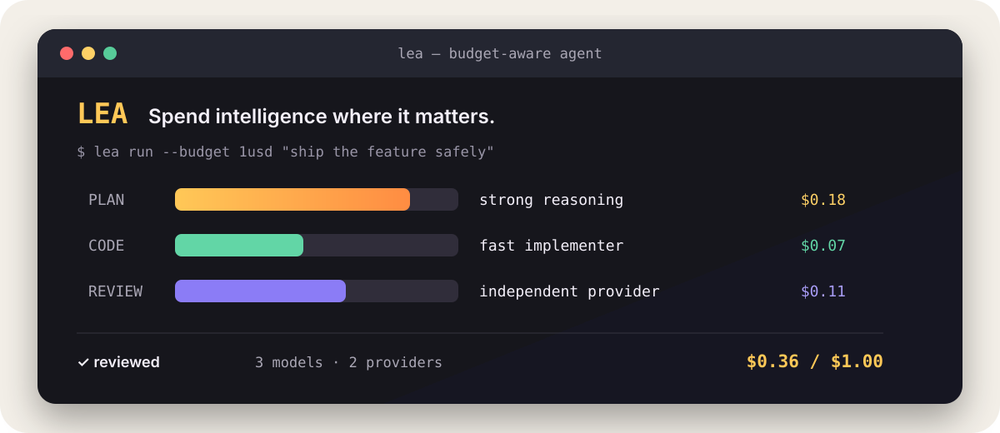

# LEA — 轻量多模型编程 Agent

<p align="center">
  
</p>

**把钱花在真正需要智能的地方。**

LEA（Light-weight Ensemble Agent）是一个本地编程 Agent。它不会把所有 token
都交给同一个旗舰模型，而是根据任务、模型能力、供应商和预算，分别选择规划、设计、
实现和审核模型。

默认策略是：**强模型做规划，便宜模型写代码，另一家模型做审核。**

## 一分钟安装

```bash
pipx install git+https://github.com/charlesenchine-arch/Light-weight-Ensemble-Agent.git
```

也可以从源码安装：

```bash
git clone https://github.com/charlesenchine-arch/Light-weight-Ensemble-Agent.git
cd Light-weight-Ensemble-Agent
python -m venv .venv

# Windows PowerShell
.\.venv\Scripts\Activate.ps1

# macOS / Linux
source .venv/bin/activate

pip install -e ".[dev]"
```

复制 `.env.example` 为 `.env`，至少填写一个供应商 API Key，然后在任意项目目录运行：

```bash
lea init
# 将 .env.example 复制为 .env，并填写 Key
lea
```

## 按预算运行

```bash
lea run --budget 10cny "修复登录接口并补充测试"
lea run -m fast --budget 0.2usd "把字段 timeout 改成 request_timeout"
lea run --dry-run --budget 5cny "重构支付流水线"
```

`--dry-run` 只展示任务分类、模式和模型组合，不调用 API。正式运行时，每次 API
请求之前还会进行一次预算检查：必要时缩小输出上限，余额不足时直接停止请求。

## 可复现成本基准

四个固定场景、相同角色 token 假设下，`balanced` 路由的目录估算总成本为
`$0.2925`，所有阶段都使用 `grok-4.6` 的基线为 `$0.6596`，预计节省 **55.7%**。

```bash
lea benchmark
lea benchmark --json
lea benchmark --baseline claude-sonnet-5
```

该结果只比较公开目录中的价格模型，不宣称不同模型的输出质量相同。JSON 输出会携带
目录核验日期和官方价格来源；完整方法见[基准说明](../benchmarks/README.md)，价格溯源见
[模型目录说明](model-catalog.md)。

## 四种模式

| 模式 | 适合 | 行为 |
| --- | --- | --- |
| `fast` | 明确的小改动 | 跳过规划与模型审核 |
| `budget` | 批量、机械性修改 | 优先最低成本模型；高风险任务仍审核 |
| `balanced` | 日常开发 | 强规划、低成本实现、独立审核 |
| `quality` | 架构与高风险改动 | 旗舰规划与更强审核 |

## 连续对话和中断

| 操作 | 按键 |
| --- | --- |
| 发送；忙碌时加入队列 | `Enter` |
| 打断当前轮，并优先执行新消息 | `Ctrl+S`、`Ctrl+Enter` 或 `Alt+Enter` |
| 只打断当前轮 | `Esc` 或 `Ctrl+C` |
| 换行 | `Ctrl+J` |
| 撤销上一轮修改过的文件 | `/undo` |

中断信号会传给模型连接、限流等待和本地命令。请求到达模型供应商后已经产生的 token
仍可能被计费。

## 支持的供应商

- xAI / Grok
- Anthropic / Claude
- OpenAI
- Google / Gemini
- DeepSeek
- Moonshot / Kimi
- Alibaba / Qwen
- OpenRouter（备用传输）

只需要配置你实际使用的供应商。LEA 会从当前可用模型中选择路线，也可以通过
`lea models` 和 `lea use <role> <model>` 固定模型。使用 `lea models --json` 可导出包含
官方价格来源、核验日期和生命周期状态的机器可读目录。

## 安全边界

工作区内的常规文件和命令操作自动放行；工作区外路径默认拒绝；明显的系统破坏性命令
始终禁止。建议始终在 Git 仓库中运行，并在提交前查看 `/diff`。

## 参与项目

欢迎提交 Issue、功能建议和 Pull Request。开始贡献前请阅读
[CONTRIBUTING.md](../CONTRIBUTING.md)，安全问题请按 [SECURITY.md](../SECURITY.md)
中的方式私下报告。

[返回英文首页](../README.md)
